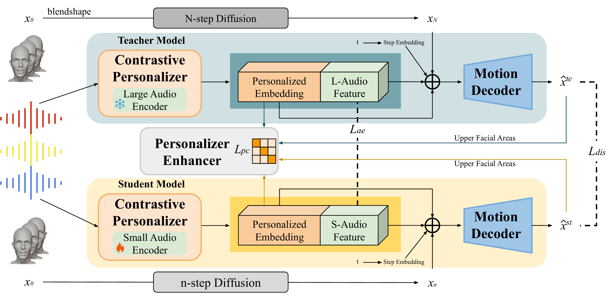

# DiffusionTalker: Efficient and Compact Speech-Driven 3D Talking Head via Personalizer-Guided Distillation

## Overview

Real-time speech-driven 3D facial animation has been attractive in academia and industry. Traditional methods mainly focus on learning a deterministic mapping from speech to animation. Recent approaches start to consider the nondeterministic fact of speech-driven 3D face animation and employ the diffusion model for the task. Existing diffusion-based methods can improve the diversity of facial animation. However, personalized speaking styles conveying accurate lip language is still lacking, besides, efficiency and compactness still need to be improved. In this work, we propose DiffusionTalker to address the above limitations via personalizer-guided distillation.  In terms of personalization, we introduce a contrastive personalizer that learns identity and emotion embeddings to capture speaking styles from audio. We further propose a personalizer enhancer during distillation to enhance the influence of embeddings on facial animation. For efficiency, we use iterative distillation to reduce the steps required for animation generation and achieve more than 8x speedup in inference. To achieve compactness, we distill the large teacher model into a smaller student model, reducing our model's storage by 86.4% while minimizing performance loss. After distillation, users can derive their identity and emotion embeddings from audio to quickly create personalized animations that reflect specific speaking styles. Extensive experiments are conducted to demonstrate that our method outperforms state-of-the-art methods. The code will be released.