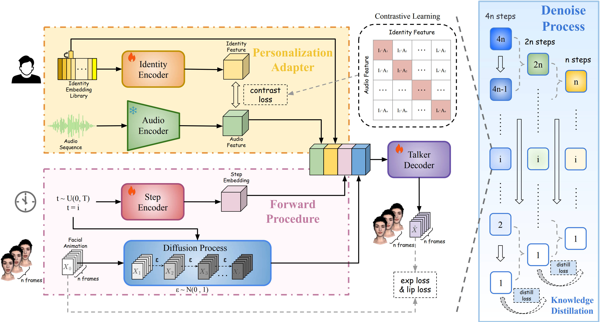

# DiffusionTalker: Personalization and Acceleration for Speech-Driven 3D Face Diffuser

The link to the paper:  [DiffusionTalker: Personalization and Acceleration for Speech-Driven 3D Face Diffuser](https://arxiv.org/abs/2311.16565)

  <b>
    <a href="https://arxiv.org/abs/2311.16565">Paper</a>
    | 
    <a href="https://chenvoid.github.io/DiffusionTalker/">Project Page</a>
    |
    <a href="https://github.com/ChenVoid/DiffusionTalker">Code</a> 
  </b>

 
  
  
    
  

**DiffusionTalker**: We reduce the steps of the diffusion model for faster inference by knowledge distillation. Based on the model with fewer steps, given an audio sequence, we can find a matching identity embedding in the identity library to personalize the speaker’s talking style.

